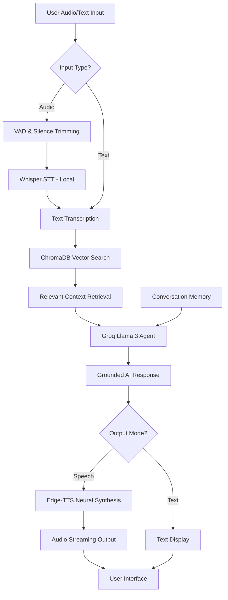

# 🎙️ AI Audio Customer Support Agent

[](https://www.python.org/)
[](https://fastapi.tiangolo.com/)
[](https://streamlit.io/)
[](https://groq.com/)

A state-of-the-art **Voice AI Agent** designed for high-performance customer support. This project integrates local Speech-to-Text (STT), Retrieval-Augmented Generation (RAG) with context-aware memory, and neural Text-to-Speech (TTS) to provide a seamless, human-like interaction experience.

---

## 📽️ Project Workflow

The following diagram illustrates the end-to-end processing pipeline of the agent:



---

## 🚀 Core Features

### 🧠 Intelligent RAG Pipeline
- **Vector Database**: Uses **ChromaDB** to store and retrieve enterprise knowledge.
- **LLM**: Powered by **Groq's Llama 3** for ultra-fast, high-quality reasoning.
- **Grounded Responses**: The agent only answers based on provided documentation, minimizing hallucinations.

### 🔊 Advanced Audio Processing
- **STT**: Local **OpenAI Whisper** integration for private and accurate transcription.
- **TTS**: **Microsoft Edge-TTS** provides natural-sounding neural voices across multiple languages.
- **VAD**: Intelligent Voice Activity Detection to trim silence and reduce processing latency.

### 🌍 Global & Contextual
- **Multi-language Support**: Automatically detects input language and responds in kind (Hindi, English, Spanish, etc.).
- **Conversation Memory**: Remembers previous turns in the conversation for follow-up support.
- **Glassmorphism UI**: A premium Streamlit dashboard with real-time status monitoring.

---

## 🛠️ Tech Stack

- **Frameworks**: FastAPI (Backend), Streamlit (Frontend)
- **AI Models**: Llama 3 (via Groq), Whisper (Local STT)
- **Database**: ChromaDB (Vector Store)
- **Audio Logic**: Pydub, Edge-TTS, FFmpeg
- **Infrastructure**: Async processing, Session-based state management

---

## 📦 Installation & Setup

### 1. Prerequisites
- Python 3.9+
- [FFmpeg](https://ffmpeg.org/download.html) (Required for audio processing)

### 2. Clone & Install
```bash
git clone https://github.com/AnkitGit-prog/audio-customer-support-agent.git
cd audio-customer-support-agent
pip install -r requirements.txt
```

### 3. Environment Variables
Create a `.env` file in the root:
```env
GROQ_API_KEY=your_key_here
STT_MODEL=base
TTS_VOICE=en-US-AriaNeural
CHROMA_PERSIST_DIR=./chroma_db
```

### 4. Run the Project
**Start Backend:**
```bash
python -m src.api.server
```
**Start Frontend:**
```bash
streamlit run streamlit_app.py
```

---

## 📂 Project Structure

```text
.
├── src/
│   ├── api/            # FastAPI Endpoints
│   ├── llm/            # RAG & Agent Logic
│   ├── stt/            # Whisper Integration
│   ├── tts/            # Voice Synthesis
│   └── pipeline.py     # Core Orchestrator
├── chroma_db/          # Knowledge Base Store
├── streamlit_app.py    # UI Implementation
├── requirements.txt    # Dependencies
└── README.md           # Documentation
```

---

## 👨‍💻 Developer Notes
This project was built with a focus on **latency** and **accuracy**. By offloading LLM tasks to Groq and keeping STT local, we achieve a balance of speed and privacy suitable for modern customer service applications.

**Developed for Interview Showcase.**
